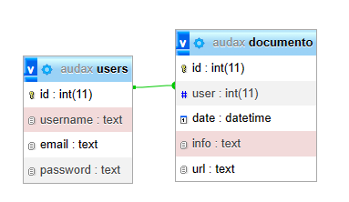

# NOTAS DE DESAROLLO
Para que se pueda ejecutar tal y como se muestra en el video:
* Se debe modificar la linea 4 del fichero controlador/controlador.php los parametros de la base de datos.
* Se tiene que subir la base de datos audax.sql tambien a un servidor SQL.
* Es esencial tener PHP para que funcione la web. (preferiblemente 8.1) [no se a testeado el codigo en otras versiones]

# SOBRE LA BASE DE DATOS:

